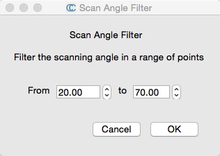
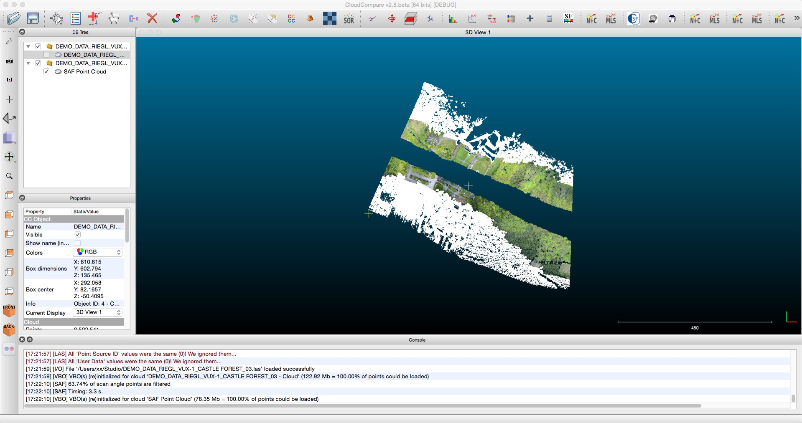

Fork from https://github.com/huihut/qSAF, and ported to the latest CloudCompare

# qSAF

qSAF(Scan Angle Filter) is a simple CloudCompare plugin that can filter a given range of scanning angles.

It is only suitable for LAS format point cloud file.

## CloudCompare

[CloudCompare](https://github.com/Bearzeng/CloudCompare)
 is an open source 3D point cloud and grid processing software that can handle all kinds of point cloud format data.

## Use qSAF in CloudCompare

#### Get source CloudCompare including qSAF

    git clone --recursive https://github.com/Bearzeng/CloudCompare.git

qSAF will be located at plugins/3rdParty/qSAF when done.

#### Generate / Run

[Generating CloudCompare project](https://github.com/Bearzeng/CloudCompare/blob/master/BUILD.md#generating-the-project)

## Tutorial

Tutorial on how to write a CloudCompare plugin. (For previor version 2.8, the source code already ported to the latest version of CC)

1. [CloudCompare插件编写一（插件框架）](http://blog.huihut.com/2017/04/27/CloudCompareSAFPlugin_1_Framework/)
2. [CloudCompare插件编写二（数据结构）](http://blog.huihut.com/2017/04/27/CloudCompareSAFPlugin_2_DataStructure/)
3. [CloudCompare插件编写三（算法实现）](https://blog.huihut.com/2017/04/27/CloudCompareSAFPlugin_3_Algorithm/)

## Screenshot

## License

[MIT](https://github.com/huihut/qSAF/blob/master/LICENSE)
